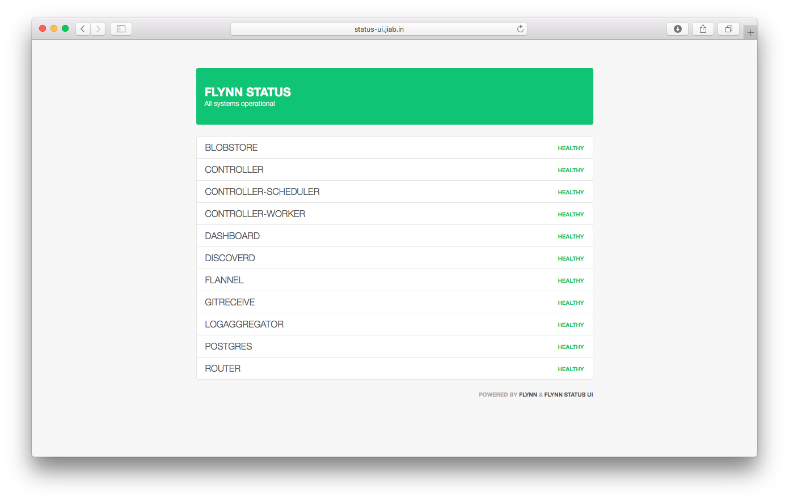

# Flynn Status UI
[](https://heroku.com/deploy?template=https://github.com/munogu/flynn-status-ui)

A simple interface for visualizing flynn cluster status.

- [Installation](#installation)
  + [On Flynn using dashboard](#installing-on-flynn-using-dashboard)
  + [On Flynn using cli](#installing-on-flynn-using-cli)
  + [On Heroku](#installing-on-heroku)
  + [Locally](#installing-locally)
- [Configuration](#installation)
- [Reporting an issue or a feature request](#reporting-an-issue-or-a-feature-request)



## Installation

Installing Flynn Status UI is a fairly simple process as the only requirements are a working Flynn cluster (duh?) and node.js.

There are few different ways to install Flynn Status UI. Pick the one Follow one of the methods below:

### Installing on Flynn using dashboard

To install using Flynn dashboard open the url below and follow the instructions on page

https://dashboard.foobar.flynnhub.com/github?owner=munogu&repo=flynn-status-ui

- If you are using a custom domain to access your cluster, replace `foobar.flynnhub.com` with that domain!

- If you are using an auto-generated flynnhub subdomain, replace `foobar` with id assigned to your cluster!

> For Vagrant clusters: https://dashboard.demo.localflynn.com/github?owner=munogu&repo=flynn-status-ui

### Installing on Flynn using cli

To install using Flynn cli

```
# Clone git repository
git clone git@github.com:munogu/flynn-status-ui.git && cd flynn-status-ui

# Create flynn application
flynn create status-ui

# (Optional) Set flynn cluster domain
# Defaults to "demo.localflynn.com"
# Vagrant users may skip this step
flynn env set FLYNN_DOMAIN=foobar.flynngub.com
flynn env set AUTH_KEY=xxx

# Deploy application
git push flynn master
```

### Installing on Heroku

You may want to keep Flynn Status UI outside of your cluster. This way the status page will remain online even if something should happen to go wrong with your cluster.

[](https://heroku.com/deploy?template=https://github.com/munogu/flynn-status-ui)

### Installing locally

> Flynn Status UI requires node.js/npm. Make sure that you have installed and configured node.js.

```
# Install dependencies via npm
cd /path/to/flynn-status-ui && npm install

# Set Flynn domain
export FLYNN_DOMAIN=foobar.flynngub.com

# Set Auth key
export AUTH_KEY=xxx

# Set title
export TITLE="Acme Inc."

# Run application
npm start
```
*Not tested on Windows*


## Configuration

Flynn Status UI stores configuration in environment variables.

| Key          | Description                              | Default value       |
|--------------|------------------------------------------|---------------------|
| FLYNN_DOMAIN | Flynn cluster domain                     | demo.localflynn.com |
| AUTH_KEY     | Status app authentication key            |                     |
| TITLE        | Application title                        | Flynn               |
| INTERVAL     | Check interval (in seconds)              | 30                  |
| TIMEOUT      | Status HTTP request timeout (in seconds) | 5                   |

Learn more:

* [Flynn - How can I pass configuration to my app?](https://flynn.io/docs/faq/how-can-i-pass-configuration-to-my-app)
* [Heroku - Configuration and Config Vars](https://devcenter.heroku.com/articles/config-vars)

## Reporting an issue or a feature request

Issues and feature requests related to this project are tracked in the Github issue tracker: https://github.com/munogu/flynn-status-ui/issues
